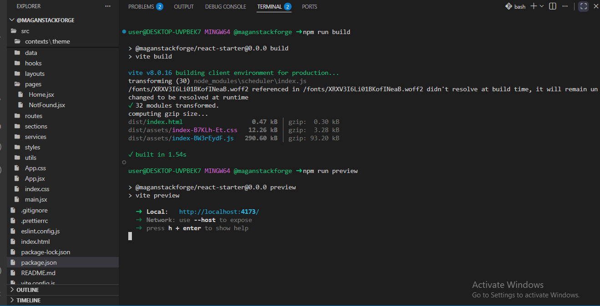
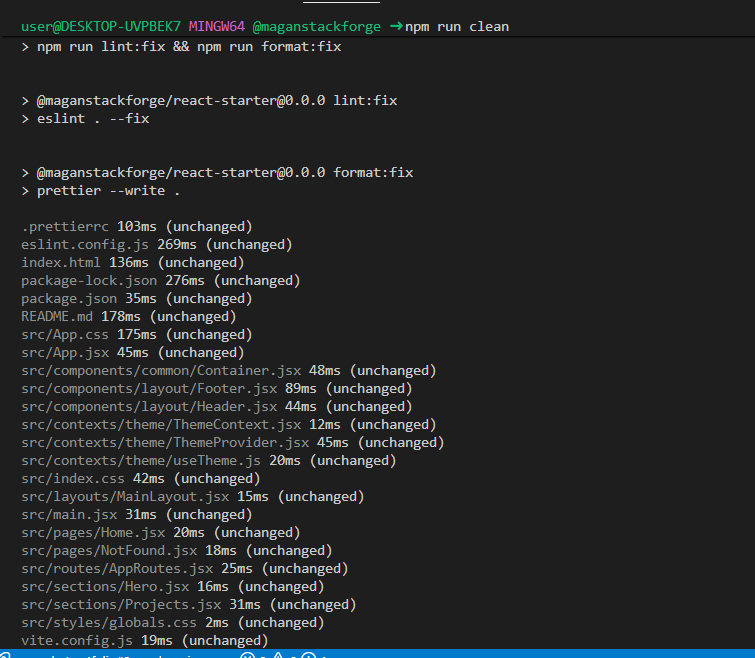

# ⚡ React Starter

A modern and scalable React starter template built with React, Vite, Tailwind CSS, React Router, ESLint, and Prettier.

This starter provides a clean project structure, reusable layout system, theme management, routing setup, and development tooling to help you kickstart React applications quickly.

---

## 🔗 Live Demo & Links

- **Live Site:** [globescope.netlify.app](https://globescope.netlify.app/)
- **GitHub Repository:** [maganstackforge/GlobeScope](https://github.com/maganstackforge/GlobeScope)
- **GitHub Profile:** [maganstackforge](https://github.com/maganstackforge)
- **LinkedIn:** [maganstackforge](https://linkedin.com/in/maganstackforge)
- **Email:** magan.stackforge@gmail.com

---

## 📖 About The Project

This is a modern React starter template designed to help developers quickly build scalable applications with a clean structure and best practices.

### 📸 UI Structure

A clean and scalable UI architecture designed for modern React applications.

---

## 🚀 Features

- **Core:** React 19 & Vite 8
- **Styling:** Tailwind CSS 4 (Responsive & Mobile-first)
- **Routing:** React Router 7
- **Theming:** Dark / Light Theme Support (via React Context API)
- **Architecture:** Reusable Layout Architecture & Container Components
- **Tooling:** Pre-configured ESLint & Prettier
- **Structure:** Scalable and clean folder structure

---

## 🛠️ Tech Stack

| Category             | Technologies                                   |
| :------------------- | :--------------------------------------------- |
| **Frontend**         | React.js, Vite, Tailwind CSS, React Router DOM |
| **State Management** | React Context API                              |
| **Code Quality**     | ESLint, Prettier                               |
| **Testing**          | Vitest                                         |

---

## 🧪 Testing

This starter includes **Vitest** setup for unit testing.

- Write unit tests for components and utilities.
- Run tests using the following command to ensure code quality and reliability:

```bash
npm run test
```

- Helps ensure code quality and reliability

---

## 🧹 Build & Preview Output





---

## 📂 Project Structure

## Folder Structure

src/
│
├── assets/
│ └──Images, icons, fonts
├── components/
│ ├── common/ (Reusable UI components)
│ └── layout/ (Layout components (Header, Footer))
│
├── contexts/ (React Context providers)
│
├── hooks/ (Custom React hooks)
│
├── layouts/ (Application layouts)
│
├── pages/ (Route pages)
│
├── routes/ (Router configuration)
│
├── services/ (API and external services)
│
├── styles/ (Global styles)
│
├── utils/ (Helper functions and constants)
│
├── data/ (Static data)
│
├── App.css
├── App.jsx
├── index.css
├── main.jsx
├── .gitignore
├── .prettierrc.json
├── eslint.config.js
├── index.html
├── package.json
├── package-lock.json
├── tailwind.config.js
├── vite.config.js
└── README.md

---

## 📦 Installation

### Clone Repository

```bash
git clone https://github.com/maganstackforge/maganstackforge-react-starter.git

```

### Navigate to Project

```bash
cd maganstackforge-react-starter
```

### Install Dependencies

```bash
npm install
```

### Start Development Server

```bash
npm run dev
```

### Build Production Version

```bash
npm run build
```

### Preview Production Build

```bash
npm run preview
```

---

## 🧹 Available Scripts

---

### Development

```bash
npm run dev
```

Start development server.

### Build

```bash
npm run build
```

Create production build.

### Preview

```bash
npm run preview
```

Preview production build locally.

### Lint

```bash
npm run lint
```

Run ESLint.

### Fix Lint Issues

```bash
npm run lint:fix
```

Automatically fix ESLint issues.

### Format Code

```bash
npm run format:fix
```

Format code using Prettier.

### Clean Project

```bash
npm run clean
```

Run ESLint fixes and Prettier formatting together.

---

## 🎨 Included Setup

- Theme Context
- Dark Mode Toggle
- Reusable Container Component
- Layout System
- Route Configuration
- Global Styles
- ESLint + Prettier Integration

---

## 📱 Responsive Ready

The starter follows a mobile-first approach and can be used for:

- Portfolio Websites
- Landing Pages
- Business Websites
- Dashboards
- React Applications

---

## License

This project is available for personal and commercial use.
