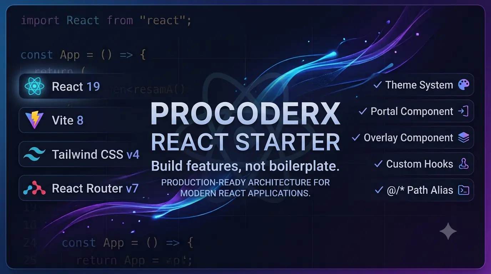

<p align="center">
  
  
  
  
  
  
</p>

<h1 align="center">
  🚀 ProCoderX React Starter
</h1>

<p align="center">
  
</p>

<p align="center">
A modern, scalable, and production-ready React starter template powered by React 19, Vite 8, Tailwind CSS v4, React Router v7, and a carefully curated developer experience.
</p>

<p align="center">
<strong>Build features, not boilerplate.</strong> ProCoderX React Starter eliminates repetitive project setup by providing a production-ready architecture, reusable UI primitives, an integrated theme system, and modern development tooling—so you can focus on building features instead of configuring your project.
</p>

<p align="center">
  
  
  
  
</p>

---

## 📚 Table of Contents

- [✨ Features](#-features)
- [🎯 Suitable For](#-suitable-for)
- [🔗 Important Links](#-important-links)
- [📁 Project Structure](#-project-structure)
- [🏗️ Folder Architecture](#️-folder-architecture)
- [🎨 Theme System](#-theme-system)
- [📦 Portal Component](#-portal-component)
- [🪟 Overlay Component](#-overlay-component)
- [🪝 Custom Hooks](#-custom-hooks)
- [🌍 Path Alias](#-path-alias)
- [🧰 Tech Stack](#-tech-stack)
- [⚙️ Installation & Setup](#️-installation--setup)
- [📦 Available Scripts](#-available-scripts)
- [🚀 Development Workflow](#-development-workflow)
- [🌍 Environment Variables](#-environment-variables)
- [🎯 Code Quality & Coding Principles](#-code-quality--coding-principles)
- [🚀 Performance & Deployment](#-performance--deployment)
- [🧩 Easily Extendable](#-easily-extendable)
- [📈 Versioning](#-versioning)
- [🤝 Contributing](#-contributing)
- [🗺️ Roadmap](#️-roadmap)
- [👨‍💻 Author & Support](#-author--support)
- [📄 License](#-license)

---

## ✨ Features

### 💻 Development & Build

- ⚛️ **React 19** – Build with the latest React features and improvements.
- ⚡ **Vite 8** – Fast development server with instant Hot Module Replacement (HMR) and optimized production builds.
- 🎨 **Tailwind CSS v4** – Modern CSS-first configuration with built-in theming support.
- 🛣️ **React Router v7** – Preconfigured routing for scalable single-page applications.

### 🏗️ Architecture & Core UI

- 🧩 **Context API** – Built-in global state management for shared application data.
- 🪝 **Custom Hooks** – Keep business logic reusable, modular, and separate from UI components.
- 🌍 **Path Aliasing (`@/*`)** – Cleaner imports without long relative paths.
- 🎨 **Theme System** – Ready-to-use Light, Dark, and System themes with persistent user preferences.
- 📦 **Portal & Overlay Components** – Reusable building blocks for dialogs, drawers, popovers, and other floating UI.

### 🧰 Developer Experience

- 🧹 **ESLint** – Enforce consistent code quality and best practices.
- 💅 **Prettier** – Automatically format your code for a consistent style.
- ⚙️ **EditorConfig** – Maintain consistent coding conventions across editors and IDEs.

---

## 🎯 Suitable For

ProCoderX React Starter is designed to accelerate the development of a wide range of modern React applications, including:

- 🌐 Portfolio Websites
- 🏢 Business Websites
- 📄 Landing Pages
- 📊 Dashboards
- ⚙️ Admin Panels
- ☁️ SaaS Applications
- 💼 Client Projects
- 📚 Learning Modern React Development

---

### 🔗 Important Links

- 🌐 **Repository:** https://github.com/theprocoderx/procoderx-react-starter
- 👤 **GitHub Profile:** https://github.com/theprocoderx
- 💼 **Portfolio:** https://procoderx.com
- 🔗 **LinkedIn:** https://linkedin.com/in/procoderx
- 📧 **Email:** procoderxs@gmail.com

---

## 📁 Project Structure

```text
PROCODERX_REACT_STARTER/
│
├── public/                     # Static assets served directly
│
├── src/
│   │
│   ├── assets/                 # Images, icons, fonts, and other static resources
│   │
│   ├── components/
│   │   ├── common/             # Shared layout components (Navbar, Footer, Sidebar)
│   │   └── ui/                 # Reusable UI components (Button, Card, Overlay, Portal)
│   │       ├── overlay/
│   │       └── portal/
│   │
│   ├── contexts/               # Global state providers (Theme, Auth, etc.)
│   │   └── theme/
│   │
│   ├── hooks/                  # Reusable custom React hooks
│   │
│   ├── layouts/                # Shared application layouts
│   │
│   ├── pages/                  # Route-level page components
│   │
│   ├── routes/                 # Application routing configuration
│   │
│   ├── styles/                 # Global styles and theme configuration
│   │   ├── index.css
│   │   └── theme.css
│   │
│   ├── utils/                  # Utility functions and helpers
│   │
│   └── main.jsx                # Application entry point
│
├── .editorconfig
├── .env.example
├── .gitignore
├── .prettierignore
├── eslint.config.js
├── index.html
├── jsconfig.json               # Path alias configuration (@/*)
├── package.json
└── vite.config.js
```

---

## 🏗️ Folder Architecture

Each directory follows a **single-responsibility principle**, making the project easier to navigate, maintain, and scale.
| Folder | Purpose |
|--------|---------|
| **assets** | Stores images, icons, fonts, and other static resources used throughout the application. |
| **components/common** | Contains shared layout components such as Navbar, Footer, Sidebar, and other structural UI elements. |
| **components/ui** | Houses reusable UI primitives including Button, Card, Overlay, Portal, and Loader components. |
| **contexts** | Provides global application state using the React Context API. |
| **hooks** | Contains reusable custom hooks that encapsulate stateful logic and shared behaviors. |
| **layouts** | Defines reusable page layouts shared across multiple routes. |
| **pages** | Contains route-level page components rendered by the application's router. |
| **routes** | Centralizes route definitions and application navigation. |
| **styles** | Includes global styles, theme configuration, and shared CSS resources. |
| **utils** | Provides reusable helper functions, formatters, validators, and utility methods. |

---

## 🎨 Theme System

The starter includes a built-in theme system that supports automatic theme switching and persistent user preferences with minimal configuration.

### Supported Theme Modes

- ☀️ **Light** – Always uses the light theme.
- 🌙 **Dark** – Always uses the dark theme.
- 💻 **System** – Automatically follows the operating system's color scheme.

### How It Works

- Built using **Tailwind CSS v4** and CSS variables defined in `src/styles/theme.css`.
- Persists the selected theme in `localStorage` to preserve user preferences across sessions.
- Automatically detects system theme changes using the native `prefers-color-scheme` media query.

---

## 📦 Portal Component

The starter includes a reusable **Portal** component built on top of `ReactDOM.createPortal()`. It renders UI outside the normal React component tree, making it ideal for overlays, dialogs, drawers, tooltips, popovers, and other floating elements.

### Why Use a Portal?

- Prevents overflow clipping caused by parent containers.
- Avoids z-index and stacking context issues.
- Renders floating UI at the document root for predictable positioning.
- Simplifies building reusable overlay-based components.

### Usage Example

```jsx
import { Portal } from '@/components/ui/portal';

export default function ModalExample() {
  return (
    <Portal>
      <div className='fixed inset-0 flex items-center justify-center bg-black/50'>
        <div className='rounded-lg bg-white p-6 shadow-xl dark:bg-zinc-900'>
          <p>I escape parent container constraints safely!</p>
        </div>
      </div>
    </Portal>
  );
}
```

---

## 🪟 Overlay Component

The starter includes a reusable **Overlay** component for creating modal backdrops, drawers, sidebars, popovers, and other layered UI elements. It provides a consistent foundation for handling background overlays, click-outside interactions, and backdrop effects.

### Features

- Supports click-to-close interactions.
- Easily configurable with custom classes.
- Works seamlessly with the built-in `Portal` component.
- Ideal for modals, drawers, sidebars, and other floating UI.

### Usage Example

```jsx
import { Overlay } from '@/components/ui/overlay';

export default function DrawerExample({ isOpen, onClose }) {
  if (!isOpen) return null;

  return (
    <Overlay className='z-40 backdrop-blur-sm' onClick={onClose}>
      <div className='fixed top-0 right-0 h-full w-80 bg-zinc-50 p-6 shadow-2xl dark:bg-zinc-950'>
        <h2>Sidebar Content</h2>
      </div>
    </Overlay>
  );
}
```

---

## 🪝 Custom Hooks

The starter promotes a clean separation of concerns by moving reusable stateful logic into custom hooks. This keeps components focused on rendering while making application logic easier to reuse, test, and maintain.

### Usage Example

```jsx
import { useTheme } from '@/hooks/useTheme';

export default function ThemeToggle() {
  const { theme, setTheme } = useTheme();

  return <button onClick={() => setTheme(theme === 'dark' ? 'light' : 'dark')}>Current Mode: {theme}</button>;
}
```

---

## 🌍 Path Alias

The starter is preconfigured with the `@/*` path alias, allowing you to import modules from the `src` directory without long relative paths. This improves readability and makes imports easier to maintain as your project grows.

### Example

```javascript
// ❌ Relative import
import { ThemeProvider } from '../../../contexts/theme';

// ✅ Path alias
import { ThemeProvider } from '@/contexts/theme';
```

---

## 🧰 Tech Stack

### Core Technologies

- ⚛️ **React 19** – Component-based UI library for building modern web applications.
- ⚡ **Vite 8** – Fast development server and optimized production bundler.
- 🎨 **Tailwind CSS v4** – Utility-first CSS framework with a modern CSS-first configuration.
- 🛣️ **React Router v7** – Declarative routing for single-page applications.

### Architecture

- 🧩 **Context API** – Built-in global state management.
- 🪝 **Custom Hooks** – Reusable and maintainable business logic.
- 🌍 **Path Aliases (`@/*`)** – Simplified and cleaner module imports.
- 🎨 **Theme System** – Light, Dark, and System theme support.

### Developer Experience

- 🧹 **ESLint** – Static code analysis and linting.
- 💅 **Prettier** – Automatic code formatting.
- ⚙️ **EditorConfig** – Consistent coding conventions across editors.
- 📦 **npm** – Dependency and package management.

### Built-in UI Components

- 📦 **Portal Component** – Render floating UI outside the normal DOM hierarchy.
- 🪟 **Overlay Component** – Reusable backdrop for dialogs, drawers, and modals.

### Deployment

- ▲ **Vercel**
- 🌐 **Netlify**
- ☁️ **Cloudflare Pages**
- 📦 **GitHub Pages**
- ☁️ **AWS S3** (Static Hosting)

---

## ⚙️ Installation & Setup

Get started with ProCoderX React Starter in just a few steps.

### Prerequisites

Before you begin, make sure you have the following installed:

- **Node.js** (v22 or later recommended)
- **npm** (comes with Node.js)
- **Git**

### Installation

```bash
# Clone the repository
git clone https://github.com/theprocoderx/procoderx-react-starter.git

# Navigate to the project directory
cd procoderx-react-starter

# Install dependencies
npm install

# Start the development server
npm run dev
```

Once the development server starts, open your browser and visit:

```text
http://localhost:5173
```

---

## 📦 Available Scripts

The following scripts are available in the project:

| Command              | Description                                                           |
| -------------------- | --------------------------------------------------------------------- |
| `npm run dev`        | Starts the Vite development server with Hot Module Replacement (HMR). |
| `npm run build`      | Creates an optimized production build in the `dist` directory.        |
| `npm run preview`    | Serves the production build locally for testing before deployment.    |
| `npm run lint`       | Runs ESLint to detect code quality issues and potential errors.       |
| `npm run lint:fix`   | Automatically fixes ESLint issues whenever possible.                  |
| `npm run format`     | Checks code formatting using Prettier.                                |
| `npm run format:fix` | Formats project files according to the configured Prettier rules.     |

---

## 🎯 Code Quality & Coding Principles

ProCoderX React Starter follows modern development practices that promote maintainability, scalability, and a consistent developer experience.

- **Tailwind CSS v4 (CSS-First):** Uses Tailwind CSS v4's modern CSS-first configuration approach for a simpler styling workflow.
- **Separation of Concerns:** Keeps business logic in custom hooks, UI in reusable components, and application state in dedicated context providers.
- **Composition over Inheritance:** Encourages building flexible, reusable components through composition rather than inheritance.
- **Reusable Architecture:** Organizes code into modular folders and reusable building blocks to improve maintainability and scalability.
- **Consistent Code Style:** Enforces code quality and formatting with ESLint, Prettier, and EditorConfig.

---

## 🚀 Performance & Deployment

Built on modern frontend tooling, the starter is optimized for fast development, efficient production builds, and seamless deployment.

- **Optimized Production Builds:** Powered by Vite and native ES Modules for efficient bundling, tree-shaking, and fast load times.
- **Deploy Anywhere:** Generates static assets in the `dist` directory, making deployment straightforward on platforms such as **Vercel**, **Netlify**, **Cloudflare Pages**, **GitHub Pages**, **AWS S3**, and other static hosting providers.

---

## 🧩 Easily Extendable

The starter is intentionally lightweight and unopinionated, making it easy to integrate additional libraries and scale your application without changing the overall project structure.

- **State Management:** Redux Toolkit, Zustand, or Jotai.
- **Data Fetching:** Axios or TanStack Query.
- **Forms & Validation:** React Hook Form, Zod, or Yup.
- **Animations:** Framer Motion or GSAP.

---

## 📈 Versioning

This project follows **Semantic Versioning (SemVer)** to communicate changes clearly between releases.

- **Current Version:** `v1.0.0`
- **Initial Release:** July 2026

```text
v1.0.0 → Initial stable production release.
v1.0.1 → Bug fixes, patches, and minor improvements.
v1.1.0 → New features added without breaking existing functionality.
v2.0.0 → Breaking changes that require code updates.
```

---

## 🤝 Contributing

Contributions are welcome! If you'd like to improve this starter template, follow these steps:

1. Fork the repository.
2. Create a new feature branch.

```bash
git checkout -b feature/amazing-feature
```

3. Commit your changes.

```bash
git commit -m "Add amazing feature"
```

4. Push your branch.

```bash
git push origin feature/amazing-feature
```

5. Open a Pull Request.

> [!IMPORTANT]
> Before submitting a pull request, ensure the project passes all code quality checks:
>
> ```bash
> npm run lint
> npm run format
> ```

---

## 🗺 Roadmap

Planned improvements for future releases:

- [ ] TypeScript (`.ts`/`.tsx`) starter template
- [ ] Vitest + React Testing Library setup
- [ ] Error Boundary component
- [ ] Toast and Modal components
- [ ] GitHub Actions CI/CD workflow
- [ ] Docker support
- [ ] Husky + lint-staged for Git hooks
- [ ] Commitlint + Conventional Commits
- [ ] Storybook integration
- [ ] Example authentication flow
- [ ] Redux Toolkit starter
- [ ] TanStack Query integration

---

## 👨‍💻 Author

Built and maintained by **ProCoderX**.

Passionate about building production-ready React applications, reusable frontend architectures, and modern developer tools.

If you find this starter framework useful, consider supporting the project by:

- 🌟 **Starring the repository**
- 🍴 **Forking it** for your own projects
- 💬 **Opening an issue** to report bugs or suggest new features

---

## 📄 License

This project is licensed under the **MIT License**. See the [LICENSE](LICENSE) file for details.
